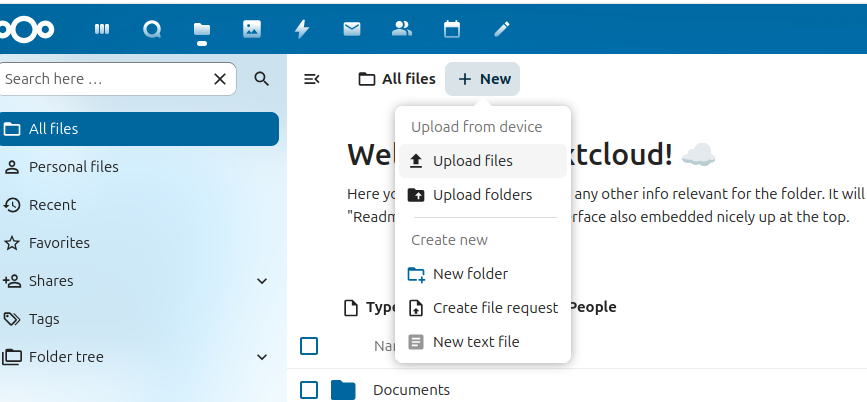
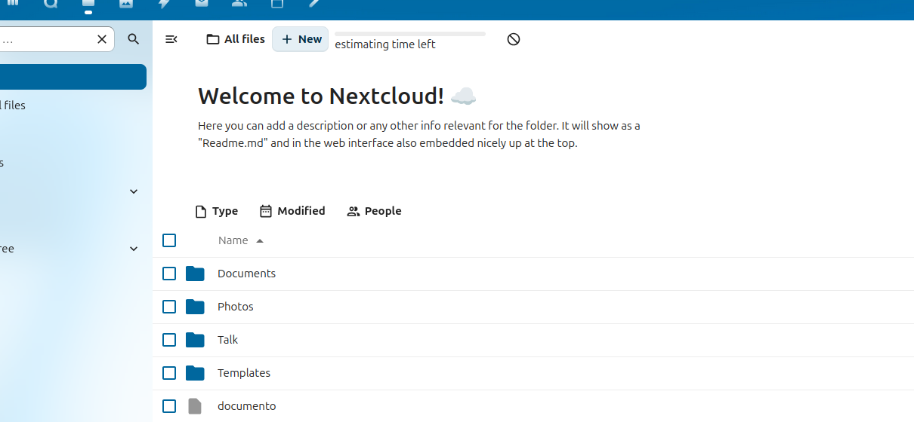
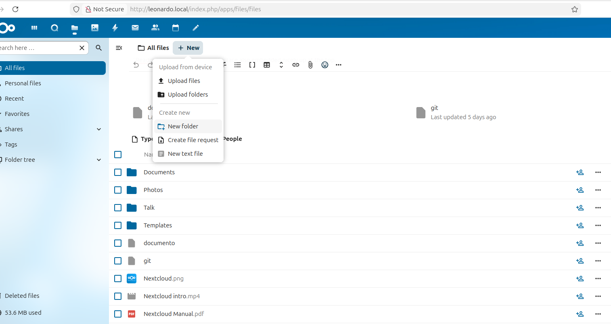
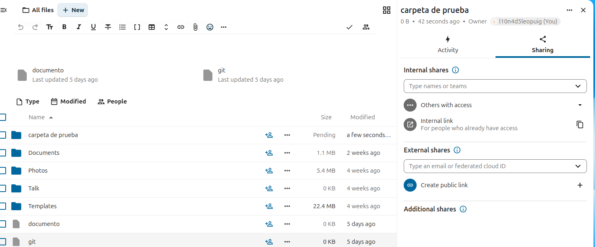
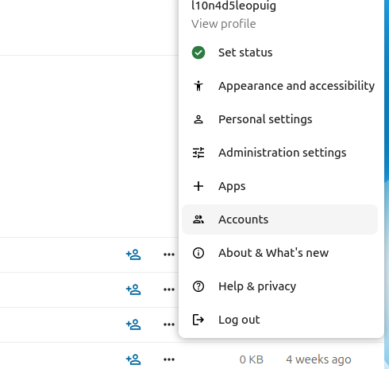
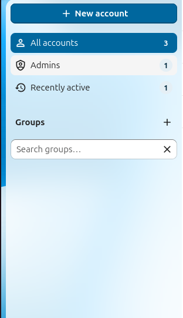
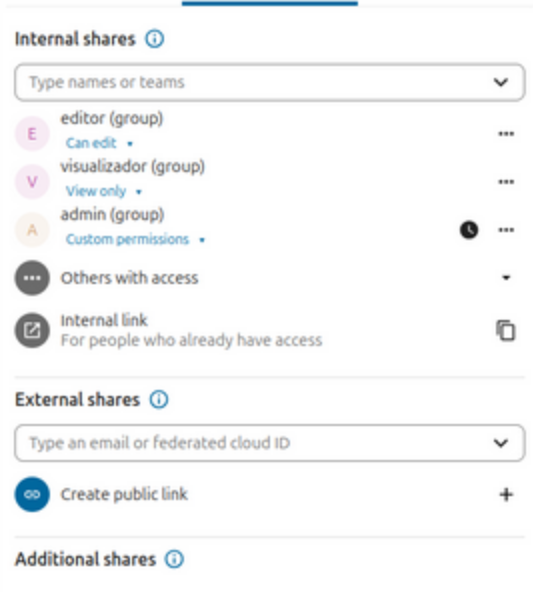

## primero de todo tienes que hacer es darle a "new" luego de eso selecciona "Upload Files" 

# Creación de carpeta en NextCloud

## entramos a new y tocamos new folder ara crear la caarpeta 

# Creación de Link 

aqui tocamos el boton del carpeta creada que es una personita azul y despues aqui tocamos en "create public link"       
# Creación de usuarios

## Aqui entramos en accounts

# Tocamos new account 

